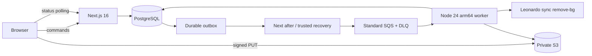

# StudioCar AI pre-production baseline

**Launch gate: NO GO.** Target main SHA: `dd835cad364493038b6c28cd0dd0434c5ded2781`. Report completed 2026-10-01T23:34:07.265944+05:30 (Asia/Calcutta). This is a source/local baseline with a complete scenario accounting registry; it is **not production certification**. No application or infrastructure bug fixes were made.

Canonical: **776 accounted, 0 missing, 0 duplicate, 0 unclassified**. PASS 130, FAIL 7, BLOCKED 637, NOT_APPLICABLE 2. Additional: 18 (5 PASS, 9 FAIL, 4 BLOCKED). Blocked scenarios were not executed. Local PASS cannot certify deployed AWS or real external providers.

Start with [FINAL-CERTIFICATION.md](FINAL-CERTIFICATION.md), [BUG-REPORT.md](BUG-REPORT.md), [HUMAN-UAT.md](HUMAN-UAT.md) and [PRE-EXECUTION-AUDIT.md](PRE-EXECUTION-AUDIT.md). [TEST-RESULTS.md](TEST-RESULTS.md) lists every ID; `results.json` and `additional-results.json` preserve complete per-test records, preconditions, steps, expected/actual, execution type, evidence, bug reference and human status. [CANONICAL-TEST-REGISTRY.md](CANONICAL-TEST-REGISTRY.md) preserves all original scenarios separately from their results.

Repository suites: 2,147 unit/component assertions PASS plus one known expected failure; 187 real PostgreSQL integration tests PASS. Browser baseline 14/15 PASS; unchanged full serial retest 15/15 PASS. Dedicated adversarial suite intentionally returns nonzero with four FAIL and one PASS. Static/template and exploratory findings are classified separately. Lint, typecheck, schema/migrations, build, production dependency audit and Lambda archive construction passed. Deployed Lambda/arm64 runtime smoke and required remote CI are unverified.



Validate accounting from the repository root:

```sh
python3 docs/testing/pre-production/validate-registry.py
```

To reproduce the defects, provide a **fresh disposable migrated local** `DATABASE_URL`, `APP_ENV=local`, Node 24 and pnpm 12.3.4, then run:

```sh
pnpm exec vitest run --config docs/testing/pre-production/baseline.vitest.config.mts
```

Expected baseline outcome: four defect assertions fail, the 20-job partial-failure assertion passes. This dedicated evidence suite is outside the existing production test discovery; it records unfixed failures without weakening/skipping required gates. External storage/provider boundaries are mocked; never point these destructive fixture tests at a shared database.

The first FREE render reproduction used the conceptual NONE token directly at the executor boundary. Final reproduction uses the actual valid `ORIGINAL` contract and independently reproduces full-resolution output; original harness evidence is retained. No false PASS was inferred from the expected-failure version-key test. Temporary Chromium harness errors were corrected outside the repository, and original browser timeout evidence remains separate from successful retests.

Twelve deterministic synthetic personas were provisioned in the disposable database without real sign-in credentials or provider traffic; see `evidence/auth/personas.json`. All fixtures and the test PostgreSQL container are disposable. No AWS/SMS/Leonardo mutations or chargeable calls were executed. Browser traces/cookies/storage state are excluded from committed evidence; image fixtures and contacts are synthetic.

Documentation was committed and pushed on `docs/production-certification-dd835cad`. `gh pr create --draft` returned GraphQL Forbidden; PR creation, remote required CI and merge remain BLOCKED. The disposable PostgreSQL container and local Next server were removed/stopped after evidence capture. Human UAT remains PENDING. Bug fixing requires the user's separate explicit approval.
